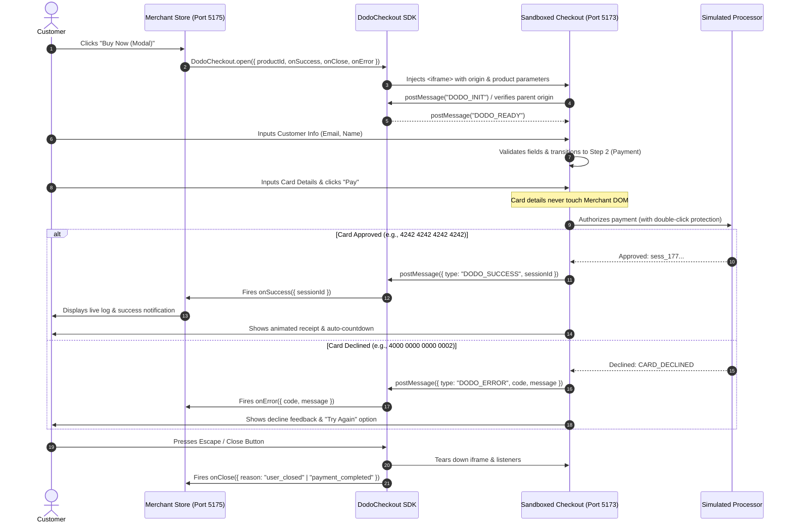

# Dodo Payments — Tiny Embeddable Checkout
---

## 🌐 Live Demo & Repository

- **Live Demo Site**: **[https://gspatil120599.github.io/DODOTASK/](https://gspatil120599.github.io/DODOTASK/)**
- **GitHub Repository**: **[https://github.com/GSPATIL120599/DODOTASK](https://github.com/GSPATIL120599/DODOTASK)**
- **Embedded Sandbox**: Available directly on the live demo page via *"Buy Now (Modal)"* (opens the embedded iframe) and *"Redirect Flow"*.

---

## 📋 Overview

Checkout is where a business gets paid. It lives on someone else's website, must work first time, and must make complex payment operations feel effortless.

This project delivers:
1. **The SDK Script** (`sdk/index.ts`): Plain TypeScript, drop-in SDK exposing `DodoCheckout.open({ productId, onSuccess, onClose, onError })`. Handles sandboxed `iframe` creation, postMessage bridge, runtime schema validation, and lifecycle cleanup.
2. **The Checkout App** (`checkout/`): Standalone web application hosted in its own domain. Collects customer details and credit card info, isolates sensitive data entirely from the merchant host page, simulates payments, and coordinates events.
3. **The Demo Merchant Store** (`demo/`): An e-commerce store with an active product spotlight, category filtering, a real-time event log for callbacks, and a Test Cards reference in the header navigation.

---

## ⚡ Quick Start

### 1. Install Dependencies
```bash
npm install
```

### 2. Start Both Services Concurrently
```bash
npm run dev
```

### 🌐 Access URLs
| Service | URL | Role |
| :--- | :--- | :--- |
| **Acme Demo Merchant Store** | **[[http://localhost:5175](http://localhost:5175)](https://gspatil120599.github.io/DODOTASK)** | Host website embedding the checkout SDK |
| **Dodo Checkout Engine** | **[http://localhost:5173](http://localhost:5173)** | Sandboxed checkout application |

---

## 🛠️ Tech Stack

- **Core & Runtime**: React 19, TypeScript 5, Vite 8
- **Styling & Motion**: Tailwind CSS v4, Lucide React icons
- **Validation**: Zod (runtime type validation for cross-origin `postMessage` envelopes)
- **Tooling**: Concurrently (parallel local dev), ESLint, TSC

---

## 🏗️ Architecture Diagram



---

## 🧩 Project Structure

```
dodo-checkout/
├── sdk/
│   ├── index.ts                     # Single-file drop-in TypeScript SDK
│   └── test.html                    # Vanilla zero-dependency test harness
├── checkout/                        # Standalone Checkout Application (Port 5173)
│   ├── src/
│   │   ├── components/
│   │   │   ├── Header.tsx           # Brand header, state title, and close action
│   │   │   ├── StepIndicator.tsx    # Visual progress bar (1. Info -> 2. Payment)
│   │   │   ├── CustomerStep.tsx     # Order review & customer form
│   │   │   ├── PaymentStep.tsx      # Card inputs, spacing formatter & test chips
│   │   │   └── ResultStep.tsx       # Receipt, session copy & retry trigger
│   │   ├── lib/
│   │   │   ├── payment.ts           # Payment processor simulation
│   │   │   └── messages.ts          # Type-safe cross-origin postMessage dispatch
│   │   ├── types/checkout.ts        # Shared domain models
│   │   ├── data/products.ts         # Products catalog
│   │   └── App.tsx                  # Controller orchestrating checkout state
│   ├── index.html                   # Hosted entry point
│   └── vite.config.ts
├── demo/                            # Acme Digital Store (Port 5175)
│   ├── src/
│   │   ├── components/
│   │   │   ├── Navbar.tsx           # Header with Test Cards Popover
│   │   │   ├── NotificationBanner.tsx # Status alert banners
│   │   │   ├── ProductSpotlight.tsx # Active product spotlight & primary CTAs
│   │   │   ├── ProductCatalog.tsx   # Category filter pills & products grid
│   │   │   └── CallbackLog.tsx      # Terminal-style real-time callback logger
│   │   ├── data/products.ts         # Merchant inventory
│   │   └── App.tsx                  # Merchant store controller
│   ├── index.html                   # Storefront entry point
│   └── vite.config.ts
└── package.json                     # Monorepo scripts (dev, build)
```

---

## 💳 Test Cards Reference

The assignment specifies three card scenarios, all implemented in `checkout/src/lib/payment.ts`:

| Card Number | Scenario | Expected Behavior |
| :--- | :--- | :--- |
| `4242 4242 4242 4242` | **Success** | Immediate payment approval; returns `sess_<timestamp>`. |
| `4000 0000 0000 0002` | **Declines** | Declined by card issuer; returns `CARD_DECLINED`. |
| `4000 0000 0000 0341` | **Retry Test** | Fails attempt #1 (`PAYMENT_FAILED`); succeeds on attempt #2. |

> **Header Quick Reference**: On the Demo Store, click **"Test Cards"** in the top navigation to view and copy these numbers anytime without cluttering the store layout.

---

## 🔌 SDK Integration & Usage

A merchant developer can drop the SDK into their application in seconds:

```typescript
import { DodoCheckout } from "./sdk/index";

// 1. Primary Embedded Modal Flow (Customer never leaves the page)
DodoCheckout.open({
  productId: "prod_123",
  checkoutUrl: "http://localhost:5173", // Optional: defaults to hosted endpoint
  returnUrl: window.location.origin,    // Optional: context return
  onSuccess: ({ sessionId }) => {
    console.log("Payment completed! Session:", sessionId);
  },
  onClose: ({ reason }) => {
    console.log("Checkout closed:", reason); // "user_closed" | "payment_completed" | "payment_failed"
  },
  onError: ({ code, message }) => {
    console.error("Payment error:", code, message);
  },
});

// 2. Optional Hosted Redirect Flow
DodoCheckout.redirectToCheckout({
  productId: "prod_123",
  checkoutUrl: "http://localhost:5173",
  returnUrl: window.location.origin,
});
```

---

## 🛡️ Implementation Details & Security Boundaries

### 1. Iframe Isolation & PCI Scope
The merchant store never reads, handles, or transmits sensitive payment information. Card fields live strictly inside the checkout application (`http://localhost:5173`). Even if the host website has rogue scripts or third-party trackers, they cannot inspect input values within the sandboxed `iframe`.

### 2. Bidirectional `postMessage` Protocol
- **Strict Origin Checking**: The SDK ignores any window message that does not originate from `CHECKOUT_ORIGIN`.
- **Runtime Schema Validation with Zod**: Incoming message payloads are verified against `CheckoutMessageSchema` before invoking merchant callbacks.
- **Direct Window Verification**: Messages are only accepted if `event.source === iframe.contentWindow`.

### 3. Double-Click & Idempotency Safeguards
When the user clicks "Pay", the submit button immediately transitions to a disabled state with an active spinner (`isProcessing = true`), preventing accidental double-charges or duplicate authorization requests.

### 4. Browser History Synchronization
Multi-step transitions within the checkout update browser history via `history.pushState` (`/checkout` ➔ `/payment` ➔ `/result`), preserving expected browser back-button navigation without causing disruptive full-page reloads.

### 5. Keyboard & Accessibility (A11y)
- Pressing `Escape` on the keyboard safely closes the checkout modal and fires `onClose({ reason: "user_closed" })`.
- Focusable inputs with native `autoComplete`, numeric `inputMode`, and ARIA role descriptions on error alerts.

---

## 🧠 Two Decisions We Went Back and Forth On

### 1. Dual Flow Architecture (Embed Modal vs. Hosted Redirect)
- **The Dilemma**: The brief highlighted an embeddable script where *"the customer never leaves the page they were on"*. However, in real-world merchant integrations, many merchants also need a full-page hosted redirect (e.g., for certain mobile webviews, strict banking redirect flows, or regulatory requirements).
- **The Decision**: Rather than choosing one at the expense of the other, we unified the underlying checkout engine to support both through a single system:
  - `DodoCheckout.open()` opens the instant embedded modal.
  - `DodoCheckout.redirectToCheckout()` navigates to the checkout domain and returns with URL status query parameters.
  - Both share the exact same step-by-step checkout UI, card validation, and simulation engine.

### 2. Immediate Modal Dismissal vs. In-Checkout Success Confirmation
- **The Dilemma**: When a payment succeeds, should the SDK immediately close the iframe and notify the parent, or should it show a receipt first?
- **The Decision**: Instantly disappearing modals often leave customers anxious about whether their credit card was charged. We chose to display an animated confirmation receipt inside the checkout displaying the verified `Session ID`, amount paid, and copy button, paired with an automatic 4-second countdown that then cleans up the modal and notifies the parent. This reinforces buyer trust while guaranteeing the parent store receives the event.

---

## 🚀 What We'd Explore Next

1. **Alternative Payment Methods (APMs)**: Seamless integration of Apple Pay / Google Pay via the Payment Request API, plus UPI and European SEPA direct debits.
2. **Webhook Verification & Idempotency Keys**: Server-to-server webhook delivery signed with HMAC (`dodo-signature`), allowing merchants to provision entitlements reliably even if the customer closes their browser tab mid-flight.
3. **Automated 3D Secure 2.0 (SCA)**: Step-up authentication challenge modal when mandated by card issuers in the EU/UK.
4. **Merchant Theming API**: Allowing merchants to supply light/dark tokens (`theme: { primaryColor, accentColor, borderRadius, font }`) passed into the iframe without compromising security.

---

## 🏁 Verification & Build

```bash
# Build both checkout and demo apps:
npm run build
```
Both applications compile cleanly with strict TypeScript type-checking and zero warnings.
